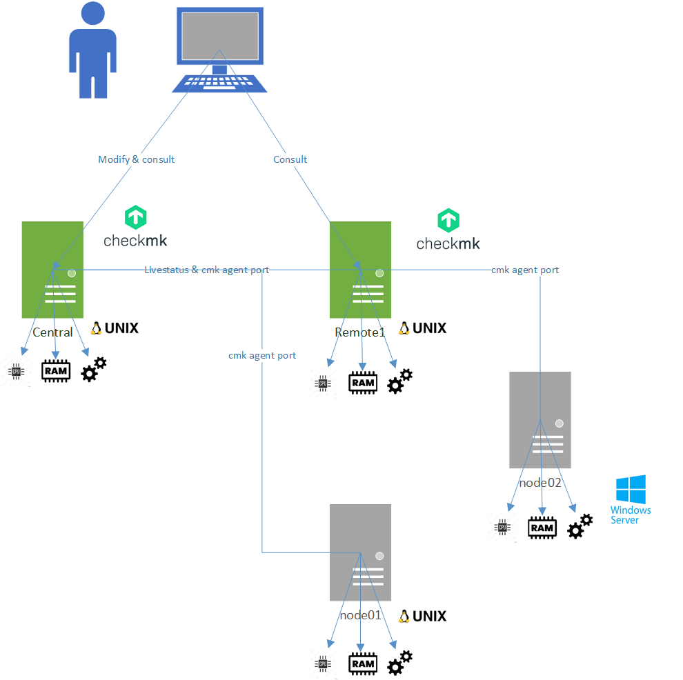
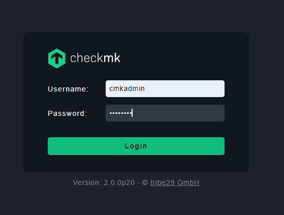
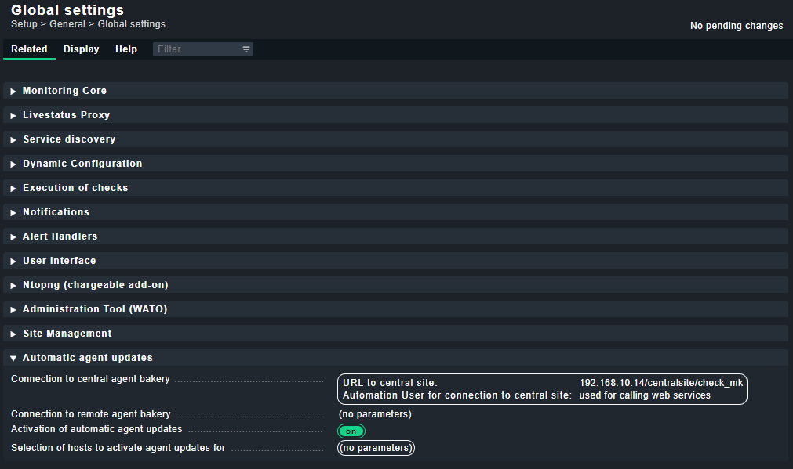
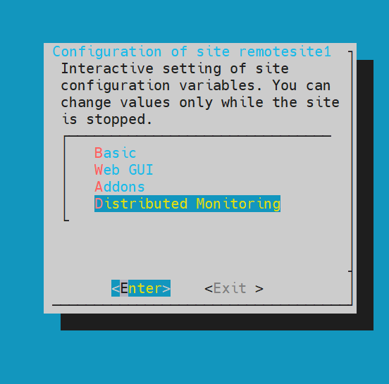
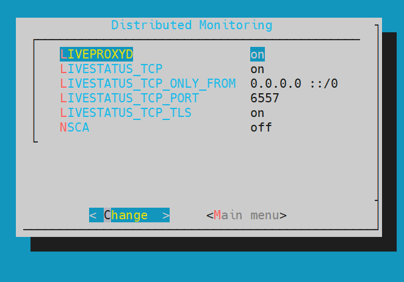
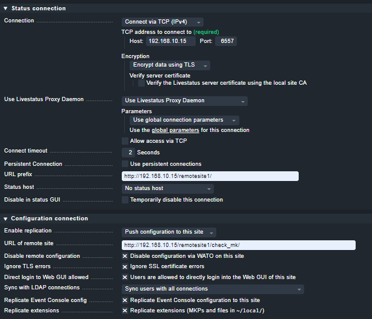
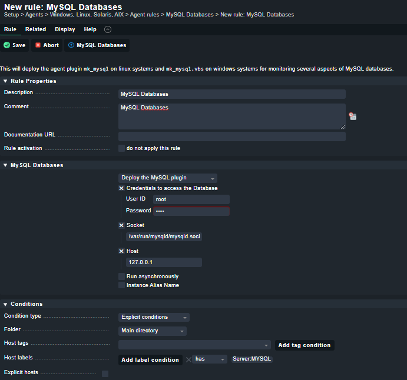
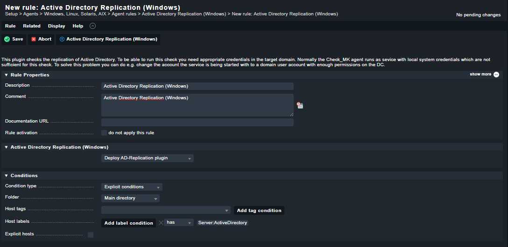
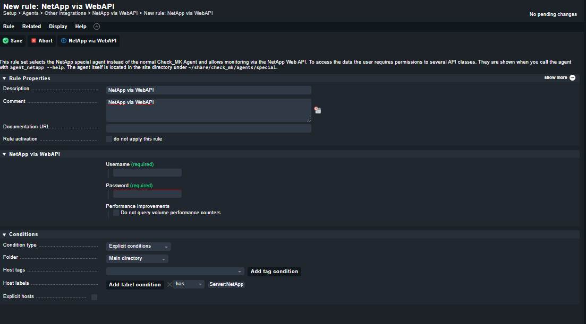

# Prerequisites.
The Infrastructure deployed in this tutorial is based on Vagrant and VirtualBox.
Before starting, you need to install *[Vagrant](https://www.vagrantup.com/docs/installation)* and *[VirtualBox](https://www.virtualbox.org/)*.

I've previuously downloaded and putted on Sources directory check-mk-raw-2.0.0p20-el7-38.x86_64.rpm file from Check_MK site.

# Architecture

# Getting started

```bash
git clone https://github.com/duprefm/vagrant-CheckMK-platform-tutorial-centos7.git
cd vagrant-CheckMK-platform-tutorial-centos7
vagrant up
```
## Central Site creation
Once the Vagrant box has spun up successfully a new site called **CentralSite** must be created.
- Connected on **central** server :

```bash
$ sudo yum install /vagrant/check-mk-free-2.0.0p20-el7-38.x86_64.rpm -y
$ sudo omd create centralsite
$ sudo omd start centralsite
```

Now CheckMK site **centralsite** is created and started, you can login to the UI using the credentials given when 'centralsite' was created and using the following url:
http://192.168.10.14/centralsite/


## Monitoring the infrastructure.
Now i will create some folders, setup 'Automatic updates' feature for agents, deploy agents on servers and setup monitoring :
- Creating folder 'CentralSite'.
- Creating folder 'RemoteSite1'.
- Setup 'Automatic updates'.

  https://docs.checkmk.com/latest/en/agent_deployment.html

  Don't forget this settings on distributed monitoring.



- Install CheckMK agent on servers.

  https://docs.checkmk.com/latest/en/agent_linux.html
  https://docs.checkmk.com/latest/en/agent_windows.html

### Install Check_MK agent on Linux
- Connected on the client side :
```bash
$ sudo yum install /vagrant/check-mk-agent-2.0.0p20-[hash].noarch.rpm -y
$ sudo /usr/lib/check_mk_agent/plugins/900/cmk-update-agent register -vvv -s 192.168.10.14 -i centralsite -p http -H [monitored server name] -U cmkadmin -P [password for cmkadmin user]
$ sudo /usr/lib/check_mk_agent/plugins/900/cmk-update-agent -v
```
### Install Check_MK agent on Windows
- Connected on the client side :
On command prompt (run as an administrator), run the following :
```dos
>msiexec /i C:\vagrant\check-mk-agent-2.0.0p20-[hash].msi /qn
C:\Program Files (x86)\checkmk\service>check_mk_agent.exe updater register -s 192.168.10.14 -i centralsite -H [monitored server name] -U cmkadmin -P [password for cmkadmin user]
C:\Program Files (x86)\checkmk\service>check_mk_agent.exe cmk_update_agent
```
## RemoteSite1 Site creation
Once the Central Site has been successfully created, a new slave site called **remotesite1** must be created.
- Connected on **remote1** server :
```bash
$ sudo yum install /vagrant/check-mk-free-2.0.0p20-el7-38.x86_64.rpm -y
$ sudo omd create remotesite1
$ sudo omd start remotesite1
$ sudo su -
# su - remotesite1
$ omd config
```
Now select Distributed Monitoring:



Set LIVESTATUS_TCP to ‘on’ and enter an available port number for LIVESTATUS_TCP_PORT that is explicit on this server. 
The default is 6557:



After saving, start the site **remotesite1** :

```bash
sudo omd start remotesite1
```

- Behind **remotesite1** settings.



# UK's needs
-	Configuration of groups, views and structure for monitoring
-	Configuration of thresholds & alerts
-	Import and export configurations or templates to simplify config for multiple systems in different networks
-	Adding/removing servers, ESX hosts, databases, Active Directory ect
    - ESX hosts

    https://docs.checkmk.com/latest/en/monitoring_vmware.html

    
    - databases

    I've decided xto install Mariadb on **node01**

    ```bash
    sudo yum install mariadb-server -y
    sudo systemctl start mariadb
    sudo systemctl enable mariadb
    sudo mysql_secure_installation
    ```
    
    https://docs.checkmk.com/latest/en/monitoring_mysql.html

    

    https://docs.checkmk.com/latest/en/monitoring_oracle.html
    - Active Directory ect

    You can setup Active Directory monitoring by enabling `Agent rules` for Active Directory

    

-	Adding/removing other devices such as NetApp, HP specific monitoring using addin to Check MK
    - NetApp

    

-	User administration
-	Reporting – general view and possible scheduling of contract required reports i.e. availability etc
-	Upgrading Check MK
-	Integration with other tools
Using API's it's possible to interact with other tools.

# Command-line Interface suviva guide
First, we need to navigate to the OMD site:

- Connected on **central** server :
```
sudo omd su centralsite
```

To query **centralsite** for all check results:

```
cmk -nv centralsite
```

In order to take a look at the site's monitoring configuration (hosts, services, etc)

```
cmk -D
```

Let's directly query `centralsite`'s agent:

```
cmk -d centralsite
```

It is also possible to run an inventory check on `centralsite`
The inventory check will query the agent for any newly discovered checks that may want to be inventorized.

```
cmk -I centralsite
```

# Writing an own agent plugin
Extending the agent with plugins is a twofold process.
- The agent needs to be extended to output a new section containing all infos
- The server needs to be extended to be able to check and inventorize this new section.

## Scenario
Assume we have a random service daemon that writes the agent's coffee level to the file `/coffee` on every host.

In the first step, we extend the agent to output an additional section with the contents of the coffee-file.
Run the following code on the vagrant box, but not inside the OMD site:

```
sudo cat <<EOF > /usr/lib/check_mk_agent/plugins/coffee
#!/bin/bash

# Maintain a reference to the coffee-file.
coffee_file=/coffee

# Output the section header.
echo "<<<coffee>>>"

# Output the contents of the coffee-file or 0 if it doesn't exist.
if [[ -r "$coffee_file" ]]; then
        cat "$coffee_file"
else
        echo 0
fi
EOF

chmod +x /usr/lib/check_mk_agent/plugins/coffee
```

In the second step, we extend the server to inventorize and check the new `<<<coffee>>>` section.

```
sudo omd su <site-name>
cat <<EOF > local/share/check_mk/checks/coffee
default_thresholds = 50, 25


def inventory_coffe(info):
    return [('Current Coffee Level', None)]


def check_coffee(item, params, coffee_level):
    try:
        warn, crit = params
    except:
        warn, crit = default_thresholds
    
    try:
        coffee_level = int(coffee_level[0][0])
    except:
        return (
            3,              # 3 equals state: unknown
            '#clueless'     # An additional description
        )

    if coffee_level < crit:
        return (
            2,              # 2 equals state: critical
            '#fixme',       # An additional description
        )

    if coffee_level < warn:
        return (
            1,              # 1 equals state: warning
            '#danger',      # An additional description
        )

    return (
        0,                  # 0 equals state: ok
        '#thereifxiedit'    # An additional description
    )

check_info["coffee.level"] = (
    check_coffee,           # Check function within this module
    "Current Coffee Level", # Service description
    0,                      # Comes with perf-data
    inventory_coffe,        # Inventory function
)

EOF

cmk -I localhost
cmk -R
cmk -nv localhost | grep coffee
```
